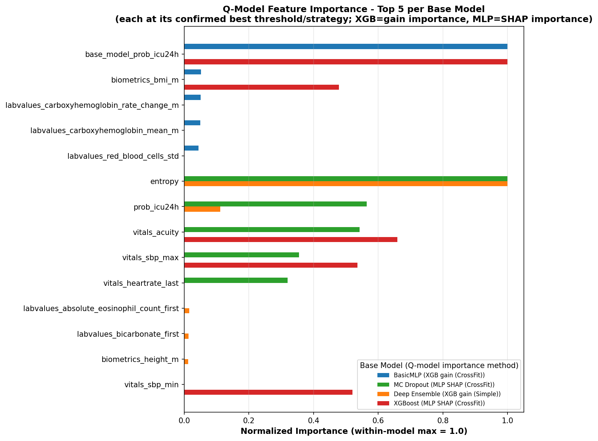

# Q-model

A pipeline for reducing false alarms (FPs) in an ICU deterioration (24h ICU admission) prediction system, by training a separate **Q-model** that predicts whether the base model's prediction is **correct or incorrect**.

## 1. Overview

Clinical early-warning models are typically operated at a fixed sensitivity (recall) threshold (≥ 0.80). At this operating point, the number of false alarms (FPs) tends to be high, leading to alarm fatigue.

The Q-model addresses this problem as follows:

```
[1] Train Base Model
     └─ Input: structured patient data (demographics, vitals, labvalues, biometrics)
     └─ Output: predicted probability of icu_24h (prob)

[2] Generate predictions at a given prob_threshold
     └─ pred = (prob >= prob_thr)
     └─ error_label = (pred != true_label)   # whether the base model's prediction was wrong

[3] Train Q-model (a "prediction correctness" classifier)
     └─ Input: base features + base model outputs (prob, uncertainty, etc.)
     └─ Output: q_prob, the predicted probability that the base prediction is wrong (error_label)
     └─ Model types: Logistic Regression / MLP / XGBoost
     └─ Training strategies: Simple (fit on full train set) vs CrossFit (5-fold cross-fitting)

[4] Filter alarms using a Q-model threshold (q_thr)
     └─ Suppress the alarm for any sample where q_prob >= q_thr
     └─ Maximize the FP reduction while keeping sensitivity >= 0.80
```

In short, this is a **post-hoc filtering** approach: if the base model raises an alarm but the Q-model judges that this particular prediction is likely wrong, the alarm is suppressed.

### Supported Base Models (4)

| Base Model | Features used | Uncertainty info |
|---|---|---|
| BasicMLP | Raw features + mask | None (probability only) |
| MC Dropout | Raw features + mask | variance, entropy (T=50 forward passes) |
| Deep Ensemble | Raw features + mask | variance, entropy, spread (M=5 members) |
| XGBoost | Raw features + mask | None (probability only) |

> mask: a binary indicator of missingness (based on `notna()`; 1 = value present, 0 = missing). All 4 base models now include mask columns as features, so they operate in the same feature space (raw features + mask).

### Q-model Input Features by Base Model

For every base model, the Q-model input is **base features (+ mask) + the base model's predicted probability**, plus any uncertainty statistics the base model produces:

| Base Model | Base features + mask | + base prob | + uncertainty stats |
|---|---|---|---|
| BasicMLP | ✅ | ✅ | — |
| MC Dropout | ✅ | ✅ | variance, entropy |
| Deep Ensemble | ✅ | ✅ | variance, entropy, spread |
| XGBoost | ✅ | ✅ | — |

---

## 2. Directory Structure

```
Q-MODEL/
├── basicmlp/
│   ├── basicMLP.py                                   # Trains the base model + extracts Q-model input features
│   ├── best_basicmlp_icu24h_only.pt                  # Trained base model checkpoint
│   ├── qmodel_basicMLP.py                            # Trains Q-model + runs prob_thr sweep
│   └── prob_thr_sweep_summary_icu24h_only_mask_trainQ.csv   # Results summary
│
├── deepensemble/
│   ├── ensemble.py                                   # Trains base model (M=5 members) + extracts features
│   ├── ensemble_member_{0..4}_icu24h_only_mask.pt     # Ensemble member checkpoints
│   ├── qmodel_deepensemble.py                         # Trains Q-model + runs prob_thr sweep
│   └── prob_thr_sweep_summary_ensemble_icu24h_only_mask_trainQ.csv
│
├── mcdropout/
│   ├── MC.py                                          # Trains base model + runs MC Dropout inference
│   ├── best_mcdropout_icu24h_only_mask.pt
│   ├── qmodel_MC.py                                   # Trains Q-model + runs prob_thr sweep
│   └── prob_thr_sweep_summary_mcdropout_icu24h_only_mask_trainQ.csv
│
├── xgboost/
│   ├── qmodel_xgboost.py                              # Trains base model (with mask) + Q-model + sweep (all in one script)
│   └── prob_thr_sweep_summary_xgboost_withmask_trainQ.csv
│
└── feature/
    ├── feature.py                                     # Computes & compares feature importance across all 4 models
    ├── feature_importance_{basicmlp,deepensemble,mcdropout,xgboost}.csv
    └── qmodel_feature_importance_top5_4models_comparison.png
```

---

## 3. How to Run

Each base model is run in two stages: **(1) train the base model → (2) train the Q-model and run the threshold sweep**. (For XGBoost, both stages are combined into a single script.)

### 3.1 BasicMLP

```bash
# 1) Train base model (single target: icu_24h) + extract Q-model input features
python basicmlp/basicMLP.py
# → best_basicmlp_icu24h_only.pt
# → results/csv/q_features_{val,test}_basicmlp_icu24h_only.csv

# 2) Train Q-model (LR/MLP/XGB × Simple/CrossFit) + sweep prob_thr (0.05–0.20)
python basicmlp/qmodel_basicMLP.py
# → prob_thr_sweep_summary_icu24h_only_mask_trainQ.csv
```

### 3.2 Deep Ensemble

```bash
# 1) Train ensemble (M=5 members)
python deepensemble/ensemble.py
# → ensemble_member_{0..4}_icu24h_only_mask.pt

# 2) Train Q-model + sweep (uncertainty features: variance, entropy, spread)
python deepensemble/qmodel_deepensemble.py
# → prob_thr_sweep_summary_ensemble_icu24h_only_mask_trainQ.csv
```

### 3.3 MC Dropout

```bash
# 1) Train base model
python mcdropout/MC.py
# → best_mcdropout_icu24h_only_mask.pt

# 2) Train Q-model + sweep (uncertainty features: variance, entropy, T=50)
python mcdropout/qmodel_MC.py
# → prob_thr_sweep_summary_mcdropout_icu24h_only_mask_trainQ.csv
```

### 3.4 XGBoost

```bash
# Base model training (now includes mask features, same space as the other 3 models)
# + Q-model training + sweep, all combined in one script
python xgboost/qmodel_xgboost.py
# → prob_thr_sweep_summary_xgboost_withmask_trainQ.csv
```

**Common output columns (`prob_thr_sweep_summary_*.csv`)**

| Column | Description |
|---|---|
| `prob_thr` | Decision threshold of the base model (0.05–0.20) |
| `strategy` | Baseline / Simple / CrossFit |
| `model` | Q-model type (LR / MLP / XGB) |
| `base_sensitivity` | Baseline sensitivity at this prob_thr |
| `best_q_thr` | Q-model threshold that maximizes FP reduction while keeping sens ≥ 0.80 |
| `sensitivity`, `TP`, `FP`, `FN`, `TN` | Confusion matrix at the selected operating point |
| `FP_reduction_pct` | FP reduction (%) relative to baseline |

Specificity, FN reduction (%), and total error reduction (%) shown in Section 5.2 are **not** columns in these CSVs — they are derived post-hoc from `TP`/`FP`/`TN`/`FN` (`specificity = TN/(TN+FP)`, `FN_reduction = (FN_base - FN_new)/FN_base * 100`, `total_reduction = ((FP_base+FN_base) - (FP_new+FN_new))/(FP_base+FN_base) * 100`).

---

## 4. Computing Feature Importance

```bash
python feature/feature.py
```

For each base model, feature importance is computed for its **confirmed best (threshold, strategy, Q-model)** combination — not uniformly "the XGB Q-model" for all four. BasicMLP and Deep Ensemble use an XGB Q-model (gain importance); MC Dropout and XGBoost use an MLP Q-model, for which gain importance doesn't apply, so **SHAP (DeepExplainer, mean |SHAP value|)** is used instead. For the MLP/CrossFit case, each fold's model is trained on the train fold and SHAP values are computed on that fold's held-out data, following standard cross-validation practice for SHAP.

Because XGB gain and MLP SHAP are on different scales, importances are normalized to max = 1.0 **within each base model** before being placed on the same comparison plot — only the relative ranking/shape within a model is comparable across models, not the raw magnitudes.

- Per-model results: `feature_importance_{model_name}.csv`
- Side-by-side comparison of the top-5 features across all 4 models: `qmodel_feature_importance_top5_4models_comparison.png`

**Top-5 feature importance comparison across all 4 models:**



---

## 5. Results

### 5.1 Baseline Model Performance

| Model | Threshold | Sensitivity | Specificity | TP | FP | TN | FN |
|---|---|---|---|---|---|---|---|
| BasicMLP | 0.10 | 0.8110 | 0.8528 | 592 | 783 | 4538 | 138 |
| MC Dropout | 0.13 | 0.8014 | 0.8508 | 585 | 794 | 4527 | 145 |
| Deep Ensemble | 0.11 | 0.8110 | 0.8613 | 592 | 738 | 4583 | 138 |
| XGBoost | *(TBD — pending re-run of `qmodel_xgboost.py` with mask included)* | | | | | | |

> XGBoost's base model was re-trained with mask features included (previously mask-excluded, per the tabular-vs-multimodal distinction in the professor's original notebook — see Section 1). This changes the baseline entirely, so the row above must be filled in from the new `prob_thr_sweep_summary_xgboost_withmask_trainQ.csv` once that script has been run.

### 5.2 Performance with Q-model Filtering (Best Operating Point per Base Model)

| Base Model | Threshold | Strategy | Q-model | Sensitivity | Specificity | FP Reduction | FN Reduction | TP | FP | TN | FN | Total Reduction |
|---|---|---|---|---|---|---|---|---|---|---|---|---|
| BasicMLP | 0.10 | CrossFit | XGB | 0.8027 | 0.8590 | 4.21% | -4.35% | 586 | 750 | 4571 | 144 | 2.93% |
| Deep Ensemble | 0.11 | Simple | XGB | 0.8096 | 0.8673 | 4.34% | -0.72% | 591 | 706 | 4615 | 139 | 3.54% |
| MC Dropout | 0.13 | CrossFit | MLP | 0.8000 | 0.8544 | 2.39% | -0.69% | 584 | 775 | 4546 | 146 | 1.92% |
| XGBoost | 0.11 | CrossFit | MLP | 0.8000 | 0.8711 | 0.58% | 0.00% | 584 | 686 | 4635 | 146 | 0.48% |

**Conclusions**
- At these operating points, the Q-model's room for improvement is small for all four base models (FP reduction between 0.58% and 4.34%) — these thresholds were themselves chosen to already have sensitivity ≥ 0.80 with a reasonably high baseline specificity, leaving little "recoverable" FP for the Q-model to remove.
- The best Q-model type differs by base model: **XGB** for BasicMLP and Deep Ensemble, **MLP** for MC Dropout and XGBoost.
- **XGBoost still shows the smallest improvement (0.58%)** of the four, consistent with its baseline already sitting close to the sensitivity/specificity trade-off boundary.
- For all four, **FN increases slightly** relative to baseline (small negative FN reduction) while FP decreases by a larger relative amount — the net effect (Total Reduction) is still positive, but modest at these particular thresholds.
- **Deep Ensemble has the highest absolute specificity (0.8673)** among the four Q-model-filtered results shown here.

> Note: these are the results at the threshold where **baseline** sensitivity and specificity are each individually maximized/first cross 0.80. A different selection rule (e.g., lowest achievable total error across *all* thresholds with sens ≥ 0.80, not just this narrower baseline-constrained set) gives substantially larger FP reductions for BasicMLP, Deep Ensemble, and MC Dropout (all Simple/CrossFit-XGB, at lower prob_thr where baseline FP is much higher) — see the full sweep CSVs for the complete threshold-by-threshold comparison.
