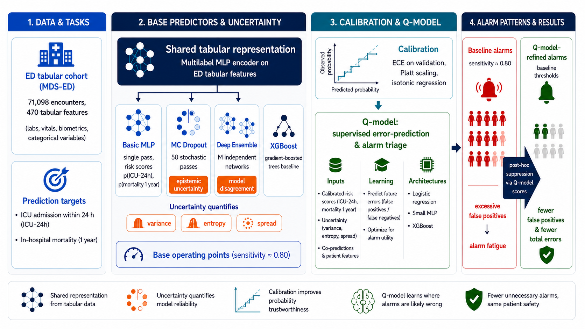

## Learning Alarm-Correctness (Q-Models) under Uncertainty-Aware Deterioration Alerts

**Keyhyun Ku, Yeji Lee, Taki Djebbar** — Carl von Ossietzky Universität Oldenburg

## Overview

Clinical early-warning systems are designed to flag patients at risk of imminent deterioration before it happens. In practice, achieving a clinically meaningful sensitivity (≈ 80%) for outcomes such as ICU admission within 24 hours or 365-day mortality requires a low decision threshold — which sharply increases the number of false-positive alarms. This drives alarm fatigue and erodes clinicians' trust in the system.

Predictive uncertainty (e.g. MC Dropout, Deep Ensembles) has been proposed as a signal for filtering out unreliable alarms, under the common assumption that correct alarms combine high predicted risk with low uncertainty. We find that this assumption breaks down precisely in the high-sensitivity regime that clinical deployment requires: important true events often occur in high-uncertainty regions, while many false positives appear confidently low-uncertainty.

We introduce the **Q-model**: a lightweight, model-agnostic secondary classifier that learns to predict whether a base model's alarm is *correct or incorrect*, using calibrated risk scores, uncertainty summaries, and co-predictions across related endpoints as input. Rather than using uncertainty as a hard rejection rule, the Q-model treats it as one learned feature among several for post-hoc alarm triage — suppressing likely-wrong alarms while leaving the base model's decision threshold and sensitivity target untouched.

We evaluate this framework on the **MDS-ED** benchmark (derived from MIMIC-IV / MIMIC-IV-Ext) across two deterioration endpoints — ICU admission within 24 hours (ICU-24h, prevalence 12.2%) and in-hospital mortality within 365 days (prevalence 13.8%) — and across four base predictors (BasicMLP, MC Dropout, Deep Ensemble, XGBoost).

## Why Q-models (vs. Uncertainty-Thresholding)

1. **"High-risk, low-uncertainty" is not a safe filter.** The common heuristic — retain only alarms that are both high-risk *and* low-uncertainty — assumes uncertainty and correctness align. Our analysis shows this breaks down under the sensitivity constraints clinical deployment requires: for both ICU-24h and 365-day mortality, true positives and false positives show substantial overlap across the entropy range, and clinically important cases frequently occur in mid-to-high uncertainty regions rather than concentrating in low-uncertainty ones.

2. **Hard uncertainty cutoffs erode sensitivity.** Because true events are enriched in high-uncertainty regions, a global "reject if uncertain" rule removes exactly the cases early-warning systems are meant to catch. Meanwhile, many false positives occur at very low uncertainty — model disagreement more often reflects difficult-but-real cases than noise, and the opposite (confident, wrong) also happens.

3. **Uncertainty is more useful as a learned feature than a standalone rule.** Rather than thresholding on uncertainty directly, the Q-model combines it with calibrated risk scores and clinical features in a single supervised classifier, letting the model learn *which combinations* of risk, uncertainty, and physiology actually predict alarm correctness — instead of assuming uncertainty alone is sufficient.

4. **The framework generalizes across endpoints.** Prior alarm-suppression work (hierarchical auxiliary classifiers, model-agnostic failure-risk estimators, confidence-based error predictors like ConfidNet) typically targets a single task or doesn't explicitly enforce a fixed high-sensitivity operating region. We show the same Q-model design consistently reduces false positives under a fixed sensitivity ≥ 0.80 constraint for both a short-term escalation endpoint (ICU-24h) and a long-horizon prognosis endpoint (365-day mortality), across four architecturally different base predictors.

## Results

**ICU-24h prediction**

| Model | τ | q_thr | Best Q-model | Sensitivity | Specificity | AUROC | FP Reduction | Total Reduction |
|---|---|---|---|---|---|---|---|---|
| BasicMLP | 0.09 | 0.83 | Simple MLP | 0.822 | 0.842 | 0.891 | 1.18% | 0.62% |
| Deep Ensemble | 0.11 | 0.77 | Simple MLP | 0.804 | 0.866 | 0.909 | 3.66% | 2.51% |
| MC Dropout | 0.13 | 0.85 | CrossFit XGB | 0.801 | 0.862 | 0.932 | 3.55% | 2.66% |
| XGBoost | 0.10 | 0.94 | Simple XGB | 0.804 | 0.859 | 0.912 | 0.53% | 0.11% |

**Mortality (365-day) prediction**

| Model | τ | q_thr | Best Q-model | Sensitivity | Specificity | AUROC | FP Reduction | Total Reduction |
|---|---|---|---|---|---|---|---|---|
| BasicMLP | 0.10 | 0.87 | Simple XGB | 0.823 | 0.730 | 0.935 | 1.74% | 1.45% |
| Deep Ensemble | 0.13 | 0.78 | Simple MLP | 0.789 | 0.774 | 0.915 | 15.87% | 11.65% |
| MC Dropout | 0.13 | 0.78 | CrossFit MLP | 0.836 | 0.720 | 0.918 | 1.87% | 1.48% |
| XGBoost | 0.09 | 0.91 | Simple XGB | 0.801 | 0.743 | 0.924 | 16.67% | 12.35% |

> FP reduction percentages are relative to each model's own baseline and are **not directly comparable across models** — for cross-model comparison, absolute FP counts or PPV are more appropriate.

## Conclusions

1. **Predictive uncertainty does not align with alarm correctness in the high-sensitivity regime.** Across both ICU-24h and 365-day mortality, true events are enriched in mid-to-high uncertainty regions while many false positives occur confidently at low uncertainty — breaking the common "high-risk, low-uncertainty" heuristic that motivates hard confidence-based filtering.

2. **A simple supervised Q-model layer substantially reshapes false-positive patterns without sacrificing the sensitivity target.** All four base predictors retain sensitivity ≥ 0.80 (or within a small margin of it) after Q-model suppression, while reducing false positives — up to 3.66% for ICU-24h and up to 16.67% for mortality.

3. **The gains are larger, but costlier, for the long-horizon endpoint.** Mortality prediction shows both bigger false-positive reductions and a more pronounced false-negative trade-off than ICU-24h, likely reflecting its lower baseline specificity (more "recoverable" false positives) and a steeper sensitivity–specificity trade-off for long-horizon outcomes.

4. **Q-models make different use of uncertainty depending on whether the base model produces it natively.** For Deep Ensemble and MC Dropout, entropy is the top-ranked SHAP feature; for BasicMLP and XGBoost, which have no native uncertainty estimate, calibrated probability (Platt/Isotonic) dominates instead — the Q-model learns to lean on whichever signal is actually informative for a given base architecture.

5. **These findings generalize across two clinically distinct prediction horizons** (short-term escalation vs. long-term prognosis) and across four architecturally different base predictors, suggesting the Q-model framework is not tied to a specific model class or endpoint.
